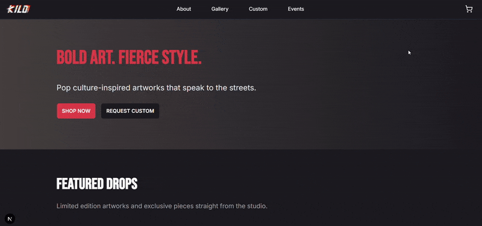

#  KiloBoy Artwork | Full-Stack E-Commerce Platform

### Live Site: https://miles-delta.vercel.app/

**KiloBoy Artwork** is a gallery and e-commerce site for a Toronto-based artist, built with **Next.js**, **Supabase**, and **Stripe**. The application manages the complete order lifecycle from product discovery to payment processing, shipping label generation, and customer notifications.

The platform is built on a secure full-stack architecture that integrates payment processing, shipping logistics, and database operations into a reliable, event-driven workflow.

---

## 🎁 Features

- Product browsing with filtering by title, description, and category
- Secure checkout using Stripe
- Automated order creation via Stripe webhooks
- Shipping label generation using Shippo
- Email receipts sent on successful payment
- Protected admin dashboard with role-based access
- Address validation before shipping label creation
- Production deployment with environment configuration and API route handling

---

## 🥞 Tech Stack

### Frontend 

  
  
  
  

### Backend

  
  
  
  

### Authentication & Security

- **Supabase Auth**
- **Middleware-protected admin routes**

### Third-Party API Integrations

- **Stripe** - Checkout sessions, payment processing, and secure webhook handling  

- **Shippo** - Server-side shipping label creation  

- **Resend** - Automated transactional email delivery  

### Deployment

-   
---

## 🔒 Security & Architecture

- Admin routes protected with middleware and role-based authentication
- Webhook signature verification for secure Stripe event handling
- Server-side order creation triggered by successful payments
- Environment variable separation for development and production
- Input validation for shipping addresses

---

## 📦 Order Flow Overview

1. Customer completes checkout via Stripe
2. Stripe sends a webhook event to the server
3. Server verifies the webhook signature
4. Order and order items are created in the database
5. Shipping label is generated
6. Confirmation email is sent to the customer

Orders are created only after verified Stripe webhook events, ensuring payment confirmation before database entries or shipping label creation.

---

##  Team

### Developers

- **Anthony Alicea**  
  GitHub: https://github.com/MOGARRR

- **Tayrine Soares**  
  GitHub: https://github.com/TayrineSoares

### Client / Brand Owner

- **Miles Antwi**  
  Instagram: https://www.instagram.com/kiloboyartwork/

## 📄 License
This project was developed for a client and is not open for commercial redistribution. Code is shared for portfolio and educational purposes only.
